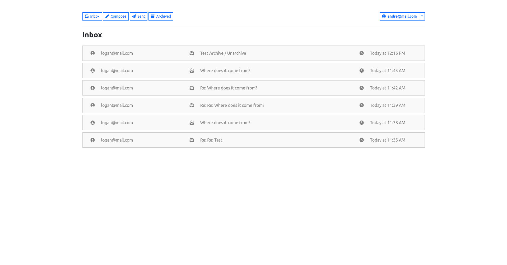
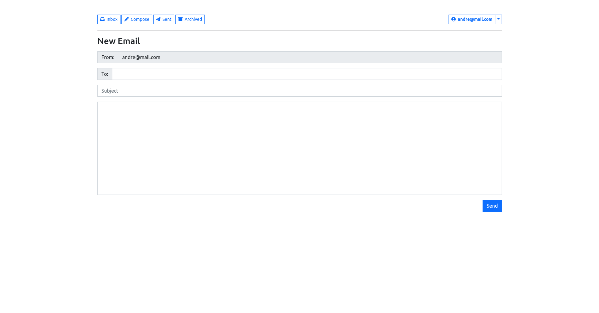
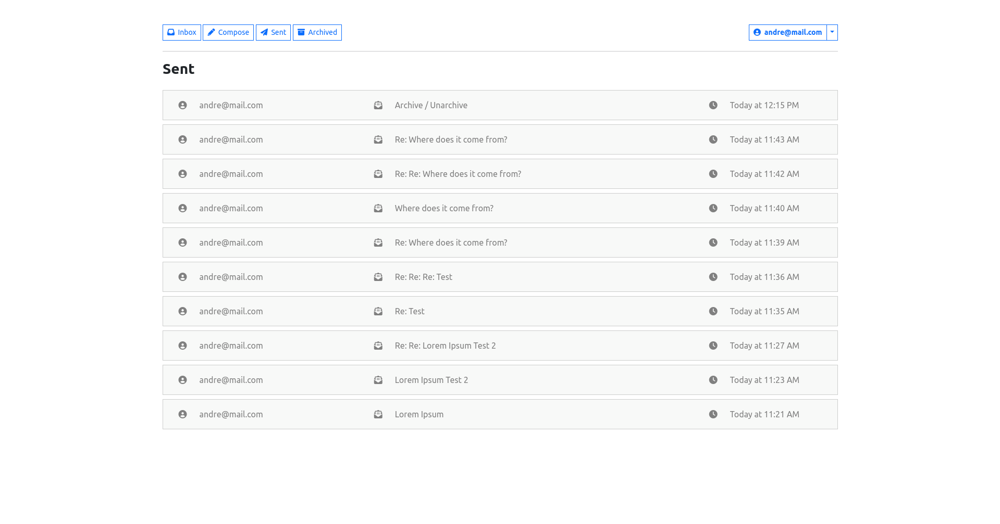
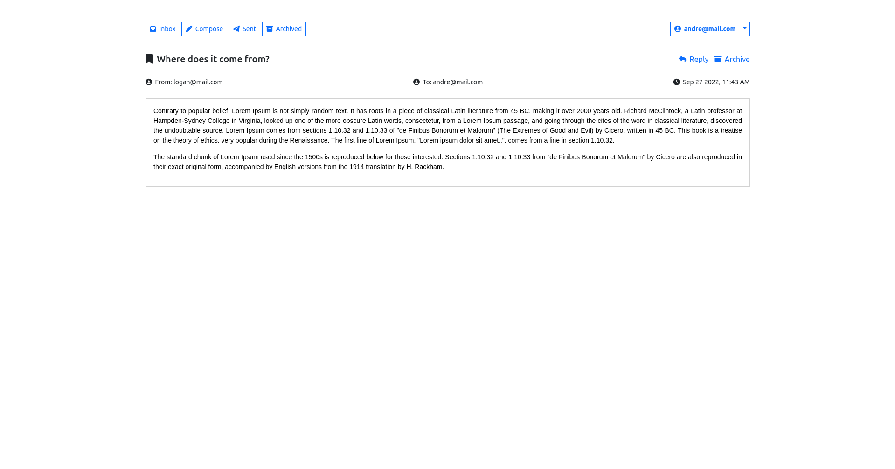
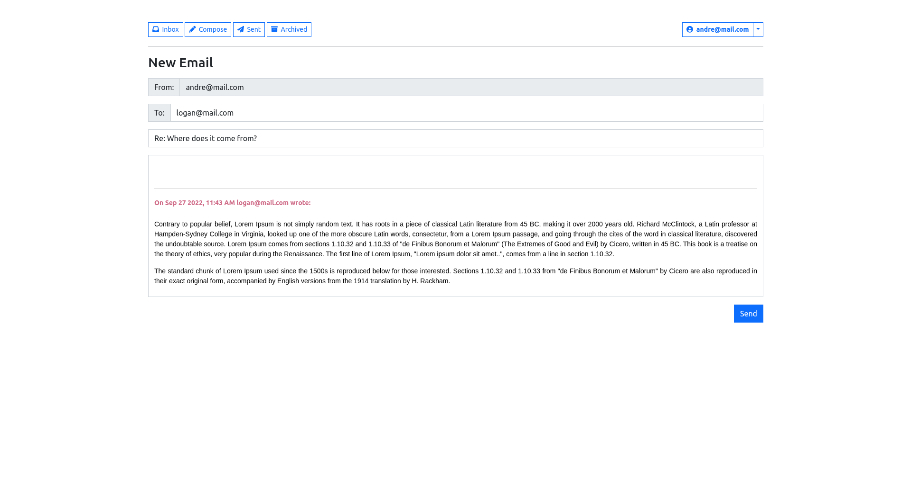

<div align="center" id="top"> 
  

&#xa0;

</div>

<h1 align="center">Mail</h1>

<p align="center">
      
</p>

<p align="center">
  <a href="#dart-about">About</a> &#xa0; | &#xa0; 
  <a href="#sparkles-features">Features</a> &#xa0; | &#xa0;
  <a href="#rocket-technologies">Technologies</a> &#xa0; | &#xa0;
  <a href="#white_check_mark-requirements">Requirements</a> &#xa0; | &#xa0;
  <a href="#checkered_flag-starting">Starting</a> &#xa0; | &#xa0;
  <a href="https://github.com/NDRBAX" target="_blank">Author</a>
</p>

<br>

## :dart: About

A front-end for an email client that makes API calls to send and receive emails.

## :sparkles: Features

:heavy_check_mark: Compose and send email\
:heavy_check_mark: Reply to an email\
:heavy_check_mark: Archive and unarchive

You can check a preview of this project on my [YouTube Channel](https://youtu.be/_9zXYKbGCmA) !

<div align="center">





</div>

## :rocket: Technologies

The following tools were used in this project:

- [Python](https://www.python.org/)
- [Django](https://www.djangoproject.com/)
- [Bootstrap 5](https://getbootstrap.com/docs/4.4/getting-started/introduction/)

## :white_check_mark: Requirements

Before starting :checkered_flag:, you need to have [Python](https://www.python.org/) and [pip](https://pypi.org/project/pip/) installed.

## :checkered_flag: Starting

```bash
# Clone this project
$ git clone https://github.com/NDRBAX/mail

# Access
$ cd mail

# Run
$ python manage.py runserver

```

Made with :heart: by <a href="https://github.com/NDRBAX" target="_blank">NDRBAX</a>

&#xa0;

<a href="#top">Back to top</a>
